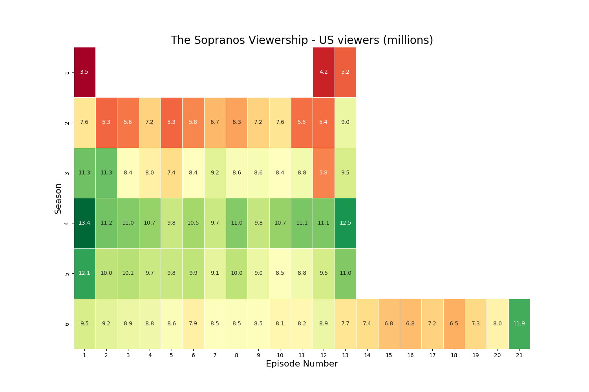
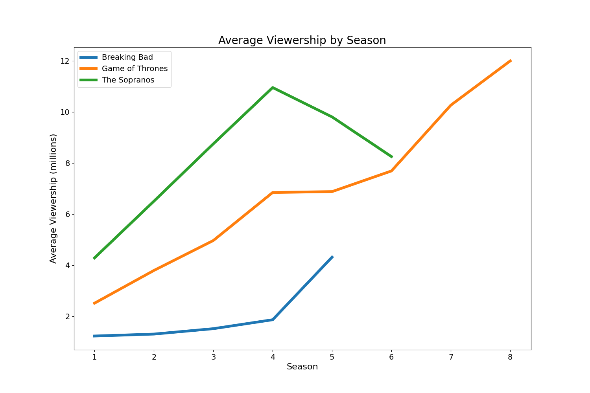

# TV Shows Viewership - Wikipedia Web Scraper

## Summary of what this script does

1. Scrapes data on various TV Shows (_The Sopranos_, _Game of Thrones_, _Breaking Bad_) regarding their US viewership during their initial airings.
2. Saves the data scraped to a .csv file.
3. Performs various calculations on the data and saves this as .csv files.
4. Creates visualisations of the data and saves as .png files

# Requirements

- Python 3.12+
- [Python Poetry](https://python-poetry.org/docs/)

## Usage

The repository is set-up to use [Poetry](https://python-poetry.org/) for dependency management. If you've got poetry, use the following from within the project folder to install dependencies and run:

**In your terminal**

    poetry install
    poetry run python tv-shows-viewers.py

## Examples of visualisations

### Heatmap

**The Sopranos** - U.S. Viewership during initial airings

### Line Graph

**Various TV Shows** - Average U.S. Viewership by Season

